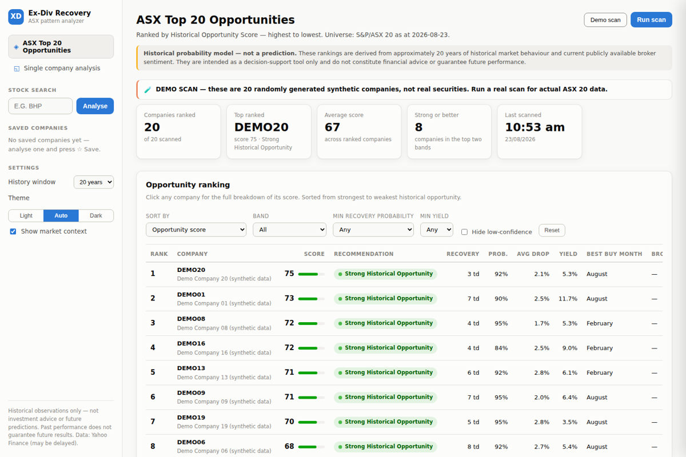
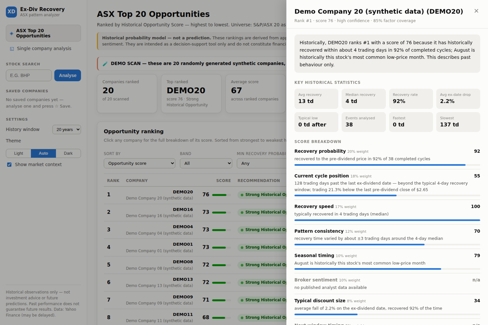

# ASX Ex-Dividend Recovery Analyzer

### 🔗 [**Open the live site →**](https://banananadia13.github.io/asx-ex-dividend-analyzer/)

**Nothing to install.** The live site shows the full ASX 20 ranking and every company's analysis, refreshed automatically each day. It works on a phone.

To analyse *any* ASX company (not just the 20), [download the app](#download-and-run) and run it locally.

---

An app that analyses roughly **20 years of history** for ASX-listed companies and answers one question:

> After a stock goes ex-dividend, how long has it historically taken for the share price to recover to where it was before?

It also ranks the **ASX Top 20** against each other, so you can see which companies currently sit closest to their own historically better buying points.

> **Historical observations only.** Everything this app shows describes what *has* happened. It is not financial advice, and it does not predict anything. Past performance does not guarantee future results.

---

## Download and run

*(Only needed if you want to analyse companies outside the ASX 20, or run it offline — otherwise just use the [live site](https://banananadia13.github.io/asx-ex-dividend-analyzer/).)*

**You need [Python 3.9 or newer](https://www.python.org/downloads/)** (free). Most Macs already have it. On Windows, tick **"Add Python to PATH"** during installation.

### 1. Download the app

Click **[`ASX_Ex_Dividend_Analyzer.py`](ASX_Ex_Dividend_Analyzer.py)** above, then click the **download button** (⬇) on the right-hand side of that page. Save it somewhere easy to find, like your Desktop.

That single file *is* the whole app — there is nothing to unzip and nothing else to install.

### 2. Run it

**On a Mac**

1. Open Terminal — press `Cmd + Space`, type `Terminal`, press Enter.
2. Type the following, **including the space at the end**:
   ```
   python3 
   ```
3. Drag `ASX_Ex_Dividend_Analyzer.py` from Finder into the Terminal window (this fills in its location), then press Enter.

**On Windows**

Right-click `ASX_Ex_Dividend_Analyzer.py` → **Open with** → **Python**.

### 3. Use it

The first run takes **1–3 minutes** to set itself up — this happens only once. After that it starts in seconds. Your browser opens automatically at `http://127.0.0.1:8477`.

Leave the black terminal window open while you use the app; that window *is* the app. Press `Ctrl + C` in it when you're finished.

> **No internet, or just want a look around?** Press **Demo scan**, or type `DEMO` as the stock code. That runs on clearly-labelled synthetic data and needs no connection.

---

## What it does

### ASX Top 20 Opportunities



Scans all 20 S&P/ASX 20 companies and ranks them by a **Historical Opportunity Score (0–100)** — how closely today resembles each company's own historically better entry points. Sort and filter by recovery time, recovery probability, average price drop, dividend yield, best buying month, broker consensus or upcoming ex-dividend date.

Click any company for the complete breakdown of *why* it scored what it did:



### Single company analysis

Enter any ASX code (BHP, CBA, WES…) for the full picture:

- Average, fastest and slowest recovery times, and how often the price recovered at all
- Where the low typically lands after the ex-dividend date, in trading days and calendar weeks
- Which months have historically offered the best buying and selling windows
- A zoomable 20-year price chart with every ex-dividend and recovery point marked
- Calendar and week-of-year heatmaps, and a year-by-year breakdown
- A table of every single ex-dividend event behind the numbers
- Broker consensus, upcoming dividend and earnings dates, and market context

Light and dark mode throughout.

---

## How the Opportunity Score works

Eight factors, each scored 0–100, combined with transparent weights:

| Factor | Weight | What it measures |
|---|---|---|
| Recovery probability | 20% | how often the price returned to pre-dividend levels |
| Current cycle position | 18% | where the price sits in its ex-dividend cycle *now*, and its discount to the last pre-dividend close |
| Recovery speed | 17% | median trading days to recover |
| Pattern consistency | 12% | how repeatable the recovery time has been |
| Seasonal timing | 10% | whether this month has historically contained lows |
| Broker sentiment | 10% | current analyst ratings and target-price upside |
| Typical discount size | 8% | size of the habitual ex-date fall, scaled by how often it recovers |
| Next window timing | 5% | how soon the next historical entry window arrives |

**Missing data is never guessed.** If a factor can't be computed — no broker coverage, say — it is dropped and the remaining weights re-normalised, so a company isn't penalised as though it scored zero. Every row shows how much of the weighting was actually available, plus a confidence level. Companies that can't be scored are listed separately rather than given an invented number.

The app shows all of this in-page, under *How the Opportunity Score is calculated*.

---

## Methodology

- **Prices** are Yahoo Finance daily closes, adjusted for stock splits only — deliberately *not* dividend-adjusted, so real cash-price behaviour is preserved.
- **Recovery** = the first trading day on or after the ex-dividend date whose close is greater than or equal to the last close before the ex-date. The ex-date counts as day 0. Search horizon is 250 trading days.
- **Pre-dividend high** = highest close between the previous ex-date and this one, capped at 130 trading days.
- **Post-dividend low** = lowest close from the ex-date through to recovery (or the horizon, if it never recovered).
- Events with fewer than 40 trading days of subsequent data and no recovery are marked **insufficient** and excluded from averages — still listed, never silently dropped.
- Suspicious events are **flagged, not hidden**: likely special dividends or demergers, price moves far larger than the dividend, ex-dates falling on non-trading days, and gaps in the price history.
- If a download fails, the app shows cached data with a clear staleness warning, or an explicit error. **It never estimates or fabricates values.**

The ASX 20 list is the S&P/ASX 20 index membership as at August 2026. S&P reviews it quarterly, so it drifts over time — the app states the as-at date.

---

## Troubleshooting

**"Python was not found" / "command not found"**
Python isn't installed, or wasn't added to PATH on Windows. Install from [python.org](https://www.python.org/downloads/) and tick *Add Python to PATH*.

**"Could not download the required libraries"**
Usually a firewall, VPN or managed work laptop blocking downloads. Try again on a home network.

**The browser page doesn't load**
Check the terminal window — it prints the exact address. If something else is already using that port, the app automatically picks another one and tells you.

**Data won't download for a company**
Double-check the ASX code. The app tells you when it can't retrieve data rather than guessing.

---

## How the live site works

GitHub Pages can only serve static files, so the Python backend can't run there. Instead, a [GitHub Actions workflow](.github/workflows/deploy.yml) runs the analysis on GitHub's servers each day, writes the results as JSON, and publishes them with the frontend.

The JSON is produced by the *same* functions the local API serves (`build_analysis_payload`, `scanner._analyse_one`), so the hosted site and the local app can't drift apart. The workflow runs the test suite first and refuses to publish if fewer than 10 companies scored — so a Yahoo Finance outage leaves the last good site up rather than replacing it with a broken one.

Trade-off: the live site covers only the pre-computed ASX 20 and is as fresh as the last daily run. Run the app locally for any ticker, on demand.

## For developers

The downloadable file is a self-contained build with the application bundled inside it; it unpacks to `~/.asx_exdiv_analyzer` and manages its own virtual environment.

The app is a small FastAPI backend serving a vanilla-JS dashboard (ECharts, no build step):

```
backend/
  main.py          FastAPI app and API endpoints
  analysis.py      ex-dividend event and aggregate statistics engine
  opportunity.py   Historical Opportunity Score — weights live here
  scanner.py       concurrent Top 20 scan with progress reporting
  insights.py      plain-English historical pattern engine
  data_source.py   Yahoo Finance fetch, disk cache, validation, demo data
  tests/           unit tests (python -m pytest tests/)
frontend/
  index.html · styles.css · app.js · vendor/echarts.min.js
```

To change the scoring, edit `WEIGHTS` in `opportunity.py` — one dict, and the whole app re-ranks. To change which companies are scanned, edit `ASX20` in the same file.

API docs are at `http://127.0.0.1:8477/docs` while the app is running.

---

## Data sources

Price and dividend history, analyst aggregates and calendar events come from Yahoo Finance via the open-source [`yfinance`](https://github.com/ranaroussi/yfinance) library. Data may be delayed, and dividend records are occasionally incomplete for older or smaller companies — the app surfaces this rather than guessing.

Complete per-broker recommendation tables require licensed services (FNArena, LSEG), so the broker section shows aggregate analyst counts, target-price statistics, and the recent named-firm rating *changes* Yahoo exposes.

## Licence

MIT — see [LICENSE](LICENSE).

**This software is for informational and educational purposes only. It does not constitute financial, investment or trading advice. Always do your own research and consider seeking advice from a licensed financial adviser.**
